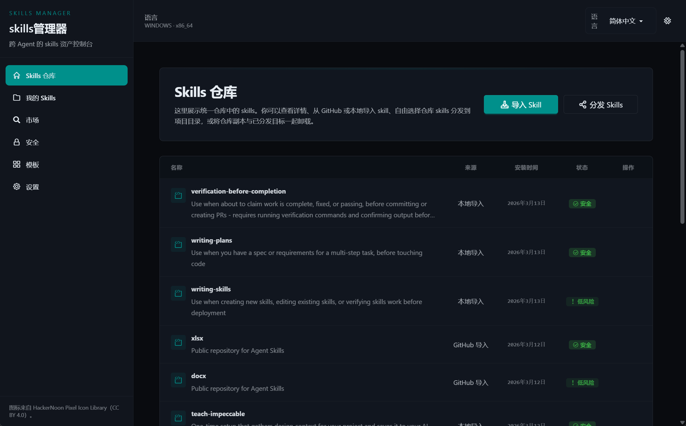

<div align="center">
  

# skills-manager

[中文](./README.md) | [English](./README.en.md)

A desktop app for managing Agent skill assets in one place. It brings together repository management, marketplace installation, security scanning, template injection, and multi-target distribution in a single `Tauri + React` workspace.

[Features](#features) • [Quick Start](#quick-start) • [Development Commands](#development-commands) • [Project Structure](#project-structure) • [Tech Stack](#tech-stack)


</div>

## Features

- **Unified skill repository**: Manage imported and installed skills, inspect metadata, sources, and deletion previews.
- **Multi-source import**: Import skills from `GitHub`, local directories, or `ZIP` archives into the canonical repository.
- **Marketplace search and install**: Search external skill providers and run security checks before installation.
- **Security reporting**: Review risk levels, findings, category breakdowns, and trigger rescans.
- **Template-based reuse**: Group repository skills into reusable templates and inject them into target projects.
- **Multi-target distribution**: Distribute skills by Agent tag directories or custom relative paths using `symlink` or `copy` mode.
- **Settings and localization**: Configure theme, language, visible targets, and repository storage migration.

> [!TIP]
> If you maintain skills for multiple Agents, this project works well as a central repository plus distribution console.

## Main Views

| View | Purpose |
| --- | --- |
| `Repository` | Browse repository skills, inspect details, import, uninstall, and distribute |
| `Skills` | Main skill management and distribution workflow |
| `Market` | Search external skill providers and install results |
| `Security` | Review security scan reports and trigger rescans |
| `Templates` | Create skill templates and inject them into projects |
| `Settings` | Manage language, theme, target directories, and repository storage |

## Quick Start

### Requirements

| Dependency | Notes |
| --- | --- |
| `Node.js` | Current LTS is recommended; the repo has been validated with `Node 22` |
| `pnpm` | Used through `corepack`, pinned to `pnpm@10.0.0` |
| `Rust` | A working stable toolchain is required |
| `Tauri` prerequisites | On Windows, WebView2 and MSVC build tools are required; verify with `tauri info` |

### Install

```bash
corepack enable
corepack pnpm install
corepack pnpm tauri info
```

### Local Development

Frontend only:

```bash
corepack pnpm dev
```

Run the desktop app in development mode:

```bash
corepack pnpm tauri:dev
```

> [!NOTE]
> `tauri:dev` starts both Vite and the Tauri desktop shell, which is the best setup for IPC integration work.

## Development Commands

| Task | Command |
| --- | --- |
| Install dependencies | `corepack pnpm install` |
| Run frontend dev server | `corepack pnpm dev` |
| Run desktop app in dev mode | `corepack pnpm tauri:dev` |
| Lint | `corepack pnpm lint` |
| Type-check | `corepack pnpm typecheck` |
| Build frontend | `corepack pnpm build` |
| Build desktop bundles | `corepack pnpm tauri:build` |
| Inspect Tauri environment | `corepack pnpm tauri info` |
| Run Rust tests | `cargo test --manifest-path src-tauri/Cargo.toml` |

## Tech Stack

| Layer | Technology |
| --- | --- |
| Desktop shell | `Tauri v2` |
| Frontend | `React 19`, `TypeScript`, `Vite`, `React Router` |
| State management | `Zustand` |
| Styling | `Tailwind CSS v4`, `daisyUI` |
| Localization | `i18next`, `react-i18next` |
| Backend | `Rust`, `rusqlite`, `ureq`, `walkdir` |

## Project Structure

```text
.
├─ src/                     # React frontend
│  ├─ app/                  # Routing
│  ├─ components/           # Reusable components and modals
│  ├─ pages/                # Top-level views
│  ├─ stores/               # Zustand stores
│  ├─ lib/                  # Utilities and Tauri IPC wrappers
│  ├─ locales/              # i18n resources
│  └─ types/                # Shared frontend/backend types
├─ src-tauri/               # Tauri / Rust backend
│  ├─ src/commands/         # Tauri command boundary layer
│  ├─ src/services/         # Core business logic
│  ├─ src/repositories/     # SQLite and persistence logic
│  ├─ src/domain/           # Domain state and types
│  └─ tauri.conf.json       # Desktop shell configuration
├─ docs/API.md              # Tauri command reference
├─ assets/                  # Design drafts and assets
└─ tep-docs/                # Product, design, and technical reference docs
```

## Architecture

The frontend calls Tauri IPC through `src/lib/tauri-client.ts`. Commands are registered in `src-tauri/src/commands/app.rs`, while the actual business logic is implemented in `services/` and persisted through `repositories/`.

Typical flow:

1. A user action is triggered in the frontend.
2. `tauri-client` calls the matching Tauri command.
3. Rust `commands` handle the IPC boundary and input/output mapping.
4. `services` run the business logic and call `repositories` when persistence is needed.
5. Frontend stores update application state and refresh the UI.

If you extend the IPC surface, update these files together:

- `src/lib/tauri-client.ts`
- `src/types/app.ts`
- `src-tauri/src/commands/app.rs`
- `src-tauri/src/lib.rs`
- `docs/API.md`

## Validation

Recommended minimum verification set:

```bash
corepack pnpm lint
corepack pnpm typecheck
corepack pnpm build
cargo test --manifest-path src-tauri/Cargo.toml
```

> [!IMPORTANT]
> For changes related to skill import, template injection, distribution, repository migration, or security scanning, always run `cargo test --manifest-path src-tauri/Cargo.toml`.

## Implementation Notes

- Routing currently uses `Hash Router`, which fits desktop distribution scenarios well.
- Built-in localization currently includes `zh-CN`, `en-US`, and `ja-JP`.
- Security-sensitive flows prefer **explicit failure** over silent fallback or fake success paths.
- Shared contracts are centralized in `src/types/app.ts`, which is the first place to update when frontend/backend data shapes change.

## References

- Reference project: <https://github.com/buzhangsan/skills-manager-client>
- API reference: `docs/API.md`
- Tauri documentation: <https://v2.tauri.app/>
- React documentation: <https://react.dev/>
